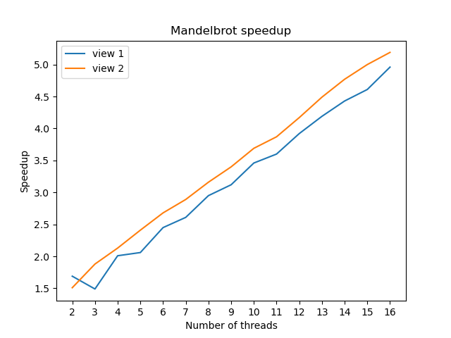

# Program 1:
- The code was in the `mandelbrotThread.cpp`, where it's simply divides the image into `number_threads` region from top to bottom and use each thread to execute on it.
- The speed up graph for the whole computation is shown here . The speedup was linear with the number of threads use. However, it exihibits a strange behavior
of the number of threads and the speed up are non 1-to-1 to each other. The linear is because of the work for each thread to handle is smaller with each thread added, hence making the relationship between the speedup and the number of threads linear. Taking credit from PKUFlyingPig's idea, the reason why the speedup is not close to 1-to-1 with the number of threads 
is because of each thread is not handling the same number of works. Looking at the picture, on view 1, one could notice the workload in the middle is higher than at the rear, for view 2, the workload is higher at the rear, lower in the middle.
- Measuring the amount of time to run 3 threads, the result is as below. As we can see here, the middle thread is computing the most out of the threads. Confirming not all threads
are working with the same workload.

    - view 1:
    ```bash
    ❯ ./mandelbrot -t 3
    [mandelbrot serial]:            [379.663] ms
    Wrote image file mandelbrot-serial.ppm
            [mandelbrot thread measure - 0 - nrows: 400]:           [76.144] ms
            [mandelbrot thread measure - 2 - nrows: 400]:           [76.619] ms
            [mandelbrot thread measure - 1 - nrows: 400]:           [237.056] ms
            [mandelbrot thread measure - 0 - nrows: 400]:           [79.839] ms
            [mandelbrot thread measure - 2 - nrows: 400]:           [80.466] ms
            [mandelbrot thread measure - 1 - nrows: 400]:           [239.162] ms
            [mandelbrot thread measure - 0 - nrows: 400]:           [76.588] ms
            [mandelbrot thread measure - 2 - nrows: 400]:           [77.870] ms
            [mandelbrot thread measure - 1 - nrows: 400]:           [237.599] ms
            [mandelbrot thread measure - 0 - nrows: 400]:           [76.763] ms
            [mandelbrot thread measure - 2 - nrows: 400]:           [77.183] ms
            [mandelbrot thread measure - 1 - nrows: 400]:           [237.010] ms
            [mandelbrot thread measure - 0 - nrows: 400]:           [77.611] ms
            [mandelbrot thread measure - 2 - nrows: 400]:           [77.883] ms
            [mandelbrot thread measure - 1 - nrows: 400]:           [236.826] ms
    [mandelbrot thread]:            [237.035] ms
    Wrote image file mandelbrot-thread.ppm
                                    (1.60x speedup from 3 threads)
    ```

    - view 2:

    ```bash
    ❯ ./mandelbrot -t 3 --view 2
    [mandelbrot serial]:            [234.794] ms
    Wrote image file mandelbrot-serial.ppm
            [mandelbrot thread measure - 2 - nrows: 400]:           [63.079] ms
            [mandelbrot thread measure - 1 - nrows: 400]:           [68.585] ms
            [mandelbrot thread measure - 0 - nrows: 400]:           [108.045] ms
            [mandelbrot thread measure - 2 - nrows: 400]:           [63.234] ms
            [mandelbrot thread measure - 1 - nrows: 400]:           [68.601] ms
            [mandelbrot thread measure - 0 - nrows: 400]:           [107.812] ms
            [mandelbrot thread measure - 2 - nrows: 400]:           [63.323] ms
            [mandelbrot thread measure - 1 - nrows: 400]:           [68.526] ms
            [mandelbrot thread measure - 0 - nrows: 400]:           [107.655] ms
            [mandelbrot thread measure - 2 - nrows: 400]:           [63.333] ms
            [mandelbrot thread measure - 1 - nrows: 400]:           [68.610] ms
            [mandelbrot thread measure - 0 - nrows: 400]:           [107.767] ms
            [mandelbrot thread measure - 2 - nrows: 400]:           [63.231] ms
            [mandelbrot thread measure - 1 - nrows: 400]:           [68.660] ms
            [mandelbrot thread measure - 0 - nrows: 400]:           [107.926] ms
    [mandelbrot thread]:            [107.726] ms
    Wrote image file mandelbrot-thread.ppm
                                    (2.18x speedup from 3 threads)
    ```
- The mapping of works is simply change to, the ith thread will work on the `row_index % i` row. The speedup for both views is approximate to 7.20x, meeting the requirements.
- Running on the 16 threads, the speedup is greatly better than 8 threads, to be specific, it is 13x speedup. The spec of running machine is 8 cores, each core with 2 threads. Hence, with more virtual threads, the speedup of system will increase with more parallel works during another thread on another core busy waiting for an IO instructions. However on 32 threads, the performance did not increase, but also reduced to 12x. This is due to the fact that there can only be a maximum number of 16 threads of execution at a time for the CPU, meaning there can only be a total maximum of 16 parallel works on the CPU. Hence the performance is capped at 16 threads.

